# Image Editor
A Python image editor exploring creative effects like pixel art, background removal, and dithering, as well as restoration techniques such as grayscale colorisation and super resolution.


## Features

### Pixel Art and Dithering
Transform images into retro-style pixel art using downsampling, color quantization via K-means clustering in perceptually-uniform CIELAB color space, and Bayer dithering for smooth gradient illusion.

<div align="center">
  
  
  <br>
  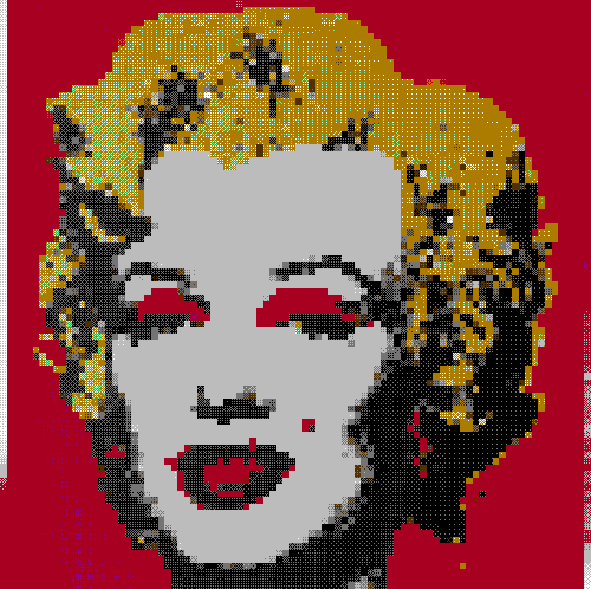
  
  <br>
  <em>Pixel-art renderings using different color palettes and Bayer dithering matrices</em>
</div>

<br>

<div align="center">
  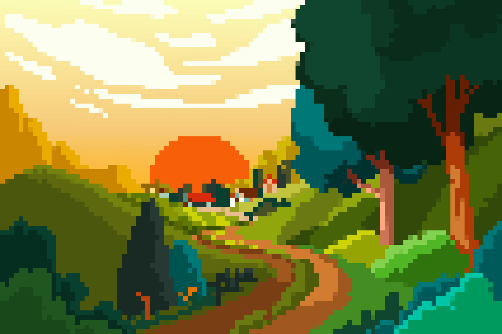
  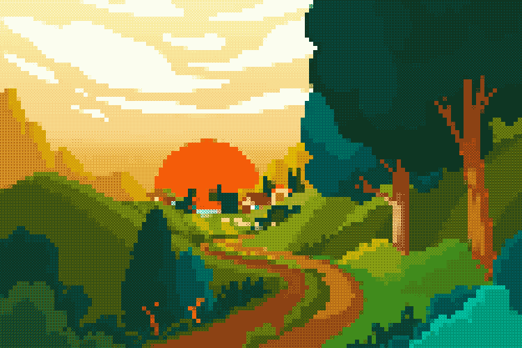
  <br>
  <em>Left: Simple pixelation | Right: K-means palette (14 colors) with Bayer 4×4 dithering creates gradient illusion</em>
</div>

<br>

<div align="center">
  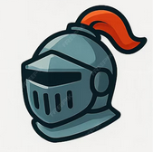
  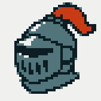
  
  <br>
  
  
  
  <br>
  <em>Effect of pixelation and structured dithering with different matrix sizes</em>
</div>

<br>

<div align="center">
  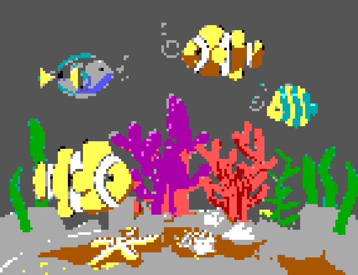
  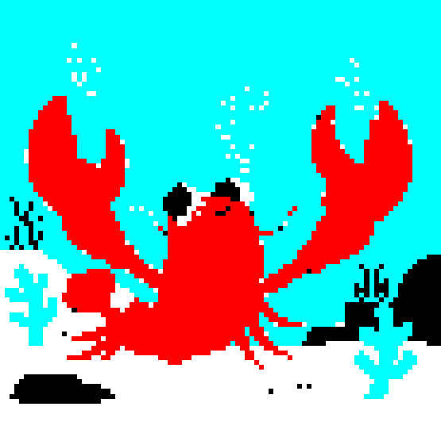
  <br>
  
  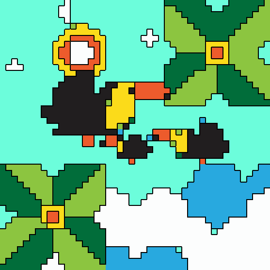
  <br>
  <em>Pixel-art renderings suitable for game assets with optional black outlines via edge detection</em>
</div>

<br>

<div align="center">
  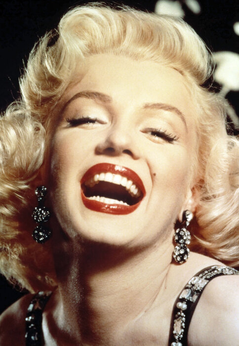
  
  <br>
  <em>Pixel art applied to photographs (works best with high-contrast preprocessing)</em>
</div>

### Super Resolution
Enhance image quality through progressive upscaling using Lanczos kernel with bilateral filtering for noise suppression, or AI-powered enhancement with Real-ESRGAN for superior detail generation.

<div align="center">
  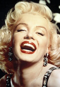
  
  
  <br>
  <em>Left: Low-res input | Middle: Algorithmic progressive upscaling | Right: Real-ESRGAN AI super resolution</em>
</div>

<br>

<div align="center">
  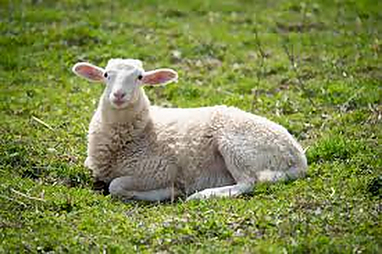
  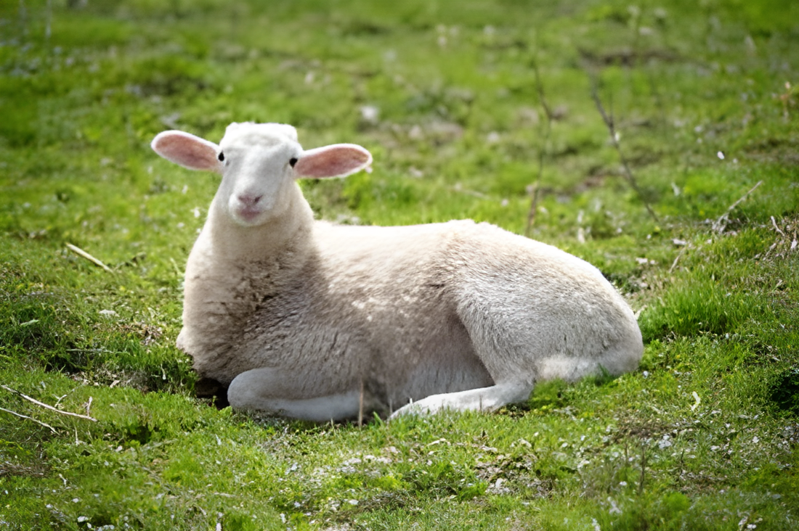
  <br>
  <em>Left: Algorithmic upscaling emphasizes edges | Right: GAN-based inference of realistic texture detail</em>
</div>

### Grayscale Image Colorization
Multiple colorization approaches were implemented: AI-powered realistic colorization using DeOldify GAN, brightness-based mapping of gray shades to user-defined color values, and interactive scribble-based optimization that propagates user-provided color hints with edge awareness and preserves luminance by editing the chrominance in YCbCr color space.

<div align="center">
  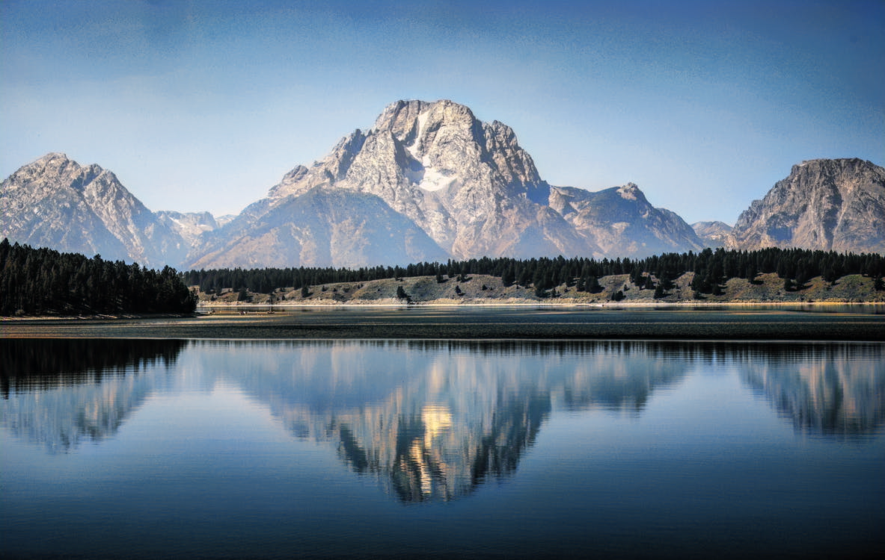
  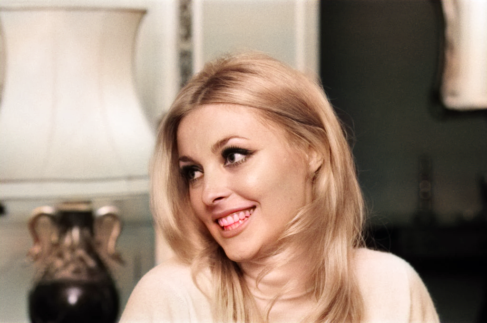
  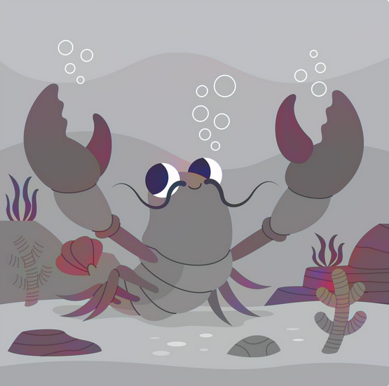
  <br>
  <em>AI-based recolorization: Excellent on natural scenes (left), good on portraits (middle), limited on illustrations (right)</em>
</div>

<br>

<div align="center">
  
  
  
  
  
  
  <br>
  <em>(1) Single-tone mapping, (2) Duotone mapping, (3), (4) Multi-color gradient mapping, (5) Scribbles input by user via the UI, (6) The result of scribble-based colorization with luminance preservation</em>
</div>

<br>

<div align="center">
  
  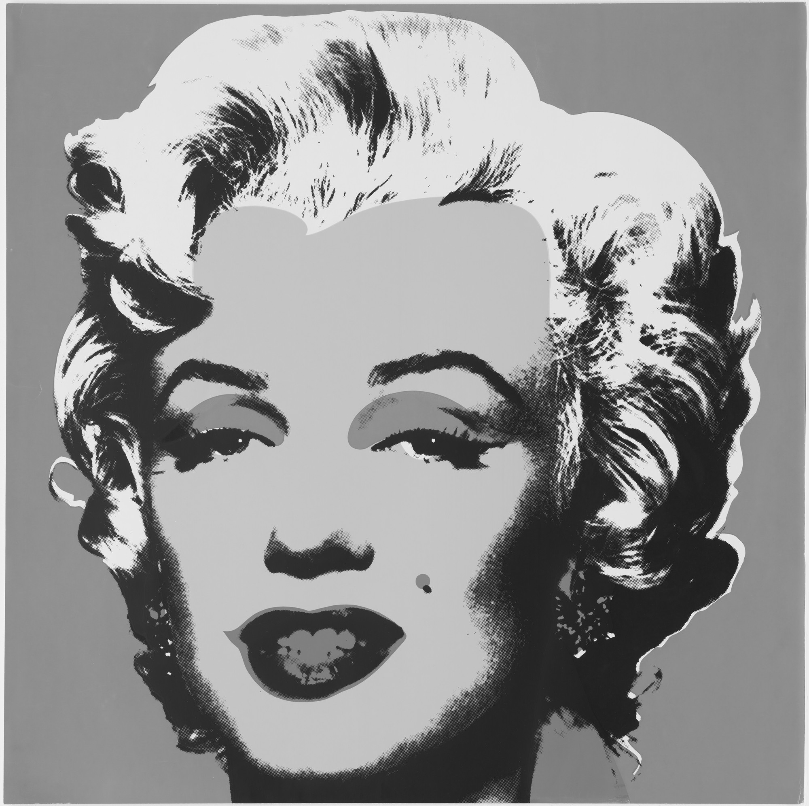
  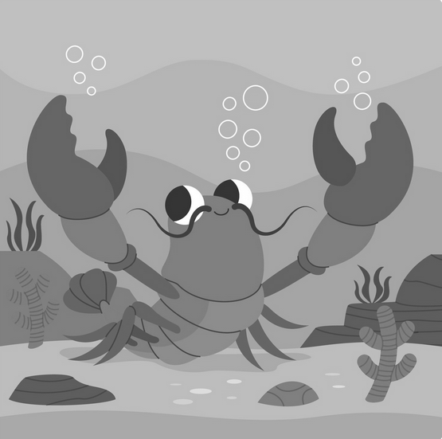
  <br>
  
  
  
  <br>
  <em>Gradient-based recolorization excels at high-contrast illustrations and stylized artwork</em>
</div>

### Background Removal and Semantic Segmentation
Interactive background removal using K-means clustering combined with marker-based watershed algorithm that snaps to high-contrast edges. AI-powered semantic segmentation via DeepLabV3+ with the option of multi-scale inference for more conservative class boundaries without spillage.

<div align="center">
  
  
  
  <br>
  
  
  
  <br>
  
  
  
  <br>
  <em>Scribble-based watershed algorithm with edge snapping for precise background removal</em>
</div>

<br>

<div align="center">
  
  
  <br>
  <em>AI semantic segmentation: Single scale (left) vs multi-scale inference (right) for improved accuracy</em>
</div>

## Setup

### 1. Create Virtual Environment

```bash
# Create virtual environment
python -m venv .venv

# Activate virtual environment
# Windows:
.venv\Scripts\activate
# macOS/Linux:
source .venv/bin/activate
```

### 2. Install Dependencies

```bash
pip install -r requirements.txt
```

### 3. Run the application:
   ```bash
   python main.py
   ```

### 4. AI Colorization of Grayscale Photos and Super Resolution

AI-powered colorization for grayscale images using [DeOldify](https://github.com/jantic/DeOldify), a deep learning model trained to add realistic colors to black and white photos.

1. Download `ColorizeStable_gen.pth` (~900MB) from [HuggingFace](https://huggingface.co/spensercai/DeOldify/blob/main/ColorizeStable_gen.pth)
2. Download `ColorizeArtistic_gen.pth` (~250MB) from [HuggingFace](https://huggingface.co/databuzzword/deoldify-artistic/blob/aae6daa766bab0496224bf01a4b7959941703bce/ColorizeArtistic_gen.pth)
2. Download `RealESRGAN_x4plus.pth` (~65MB) from [HuggingFace](https://huggingface.co/lllyasviel/Annotators/blob/main/RealESRGAN_x4plus.pth)
4. Place the files in: `aleksandra/models/`

#### Project Structure

```
ImageEditor/
├── aleksandra/
│   ├── ai_colorize.py
│   └── models/
│       └── ColorizeStable_gen.pth  # Place downloaded models here
│       └── ColorizeArtistic_gen.pth 
│       └── RealESRGAN_x4plus.pth
├── main.py
└── requirements.txt
```


**Note:** The first colorization takes 10-30 seconds while the model loads. You'll see these messages in the terminal:
```
Loading DeOldify model... (this may take a moment)
DeOldify model loaded successfully!
```

## Image Sources
- The picture `butterfly` is available on [NationalGeographic](https://kids.nationalgeographic.com/animals/invertebrates/facts/monarch-butterfly)
- The picture `crab` is available on [Freepik](https://www.freepik.com/search?format=search&term=crab#uuid=e255c617-1d87-487c-81df-8f54b66048b2)
- The picture `fish` is available on [Freepik](https://www.freepik.com/free-psd/3d-rendering-sea-life-illustration_137628740.htm#fromView=keyword&page=1&position=0&uuid=9003ce18-9b8d-4b7d-aca5-d50cd1f9c9ad&query=Printable+fish+tank+background+3d)
- The picture `sunset` is available on [Freepik](https://www.freepik.com/free-vector/hand-drawn-rural-landscape-background_49611383.htm#fromView=search&page=2&position=9&uuid=4e2ee7e0-1843-42e2-b8e0-244948ad9245&query=landscape)
- The picture `helmet` is available on [Freepik](https://www.freepik.com/search?format=search&last_filter=query&last_value=game+props&query=game+props&type=vector#uuid=08fea483-8f56-4726-8c1b-f7117adbd8b5)
- The picture `marylin_pop_art_small` is available on [Moma](https://www.moma.org/collection/works/61240)
- The picture `oranges` is available on [BeFunky](https://www.befunky.com/learn/still-life-photography-art/)
- The picture `sheep` is available on [FarmSanctuary](https://www.farmsanctuary.org/news-stories/ten-facts-about-sheep/). I use a downsized version to demonstrate AI super-resolution with it.

## License

This project is released under the MIT License.

Pretrained model weights used by this project are **not included** in the repository
and are subject to their respective licenses:
- Real-ESRGAN
- DeOldify
- DeepLabV3+
